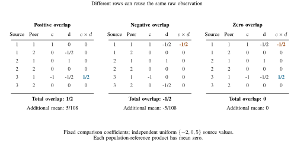

# When reference reuse interacts with time splitting

Suppose a forecast repeats yesterday's outcome. Its rank today then contains
comparisons from yesterday. Splitting today's rows does not automatically
separate the raw observations behind those comparisons.

The paper's reference-overlap lemma turns this into an exact design check.
It applies to fixed linear combinations of unstandardized comparison ranks
on independent source observations. For temporal mean fits, the fitting weights
sum to one. Ranks of a fitted weighted sum of multiple lags and random rank
standardization denominators are outside this calculation.

## Calculate the overlap

Each row of `c` and `d` refers to a **raw source time**, not a calendar row in
the transformed data. Each column refers to a peer of the focal entity.
First expand the two residuals into their signed comparison coefficients.
Then calculate:

```text
overlap = sum(c[source_time, peer] * d[source_time, peer])
additional expected product = comparison-noise variance * overlap
```

Comparisons use half credit for ties. The noise variance is
`E Var(a(Y, Y') | Y)`, with independent `Y, Y'` from the common source law.
The reference interaction vanishes for every common law exactly when the
overlap is zero. The underlying population-reference product can still be
biased. A zero overlap removes this particular extra term.

In this fixed common-law model, the population-reference mean also equals
`Var(M_F(Y)) * sum_b(sum_j(c[b,j]) * sum_j(d[b,j]))`.
Its sign is therefore constrained by the design itself. The correction below
illustrates valid centering and uncertainty; it is not a uniquely necessary
way to learn the sign, or a guarantee of genuine forecasting information.

| Design | What must be checked | What it removes |
|---|---|---|
| Separate raw source times | The two coefficient arrays use disjoint source times | The reference interaction and the shared focal-source contribution under independent source times |
| Separate peers at each source time | Nonzero coefficients never use the same peer and source time | The reference interaction; underlying temporal feedback may remain |
| Signed cancellation | The full overlap sum equals zero | The reference interaction under the common-law model |
| Different stationary peer laws | Each peer's overlap sum equals zero separately | The interaction uniformly over those independent peer laws |

The companion derives the full covariance operator, the role of ties and the
stronger conditions needed when laws vary by peer or source time. Changing the
reference mixture can also change the population target.

## A positive example with no population-reference signal

Use three independent entities and three independent source times. The focal
entity is column zero. The two peers are columns one and two. The forecast is
a one-step lag copy. Expand its residual and the outcome residual as follows:

```python
c = [[ 1.0,  0.0], [0.0, 0.0], [-1.0,  0.0]]
d = [[ 0.0, -0.5], [1.0, 0.0], [-0.5,  0.0]]
```

The population-reference product has mean zero, but overlap is `1/2`.
For uniform outcomes on `{-2, 0, 5}`, the empirical product has mean `5/108`.
Reversing which peer is used at the first and third source times reverses the
extra mean. Matching those references makes it zero. These are exact expectation
statements. They do not by themselves specify a hypothesis test.



Columns `c` and `d` are the two residuals' comparison coefficients. Multiply
within each raw source-time and peer row, then add. The [full-size PDF](source_time_overlap.pdf)
and [exact figure data](source_time_overlap.json) give the same calculation.
Regenerate with `python results/reference_time_composition/make_overlap_guide.py --output /tmp/source-time-figure`.

## Use the finite-sample correction

`reference_time_audit.audit` takes independent whole source panels, fixed
coefficient arrays, and fresh validation triples from the same law. It estimates
the comparison-noise variance from the triples, obtains a two-sided Hoeffding
interval, uses the correct endpoint for the sign of the overlap, and subtracts
that upper interaction allowance and a whole-panel sampling radius.

With `alpha=0.05` and `delta=0.01`, validation uses failure budget 0.01 and
evaluation uses 0.04. The returned lower bound exceeds the population-reference
target with probability at most 0.05 under these assumptions. The implementation
clips the variance interval to the kernel range `[0, 1/2]`. This is conservative;
the companion also derives the tighter distributional bound `1/6`.

This uses classical concentration after the new centering calculation. It is
not a claim that Hoeffding bounds are new, that they are the strongest available
inference, or that the procedure calibrates arbitrary dependent panels.
The API validates numerical inputs, but cannot verify independence from arrays.
All observations in the source panels and validation triples count toward cost.

```sh
python -m unittest discover -s results/reference_time_composition -p 'test_*.py'
python results/reference_time_composition/check_composition.py --output /tmp/reference-time-exact.json
python results/reference_time_composition/reproduce_interaction.py --output /tmp/reference-time-demonstration
```

Use new output paths. The exact checker uses Python's rational arithmetic and
requires only the standard library. The demonstration uses the package's pinned
NumPy and SciPy environment. The code preserves large integer observations so
conversion to floating point does not silently create ties.

## Complete demonstration

The fixed protocol uses 400 repetitions per law and design, 8,192 independent
whole panels and 2,048 fresh validation triples. Each repetition uses 79,872
raw observations. All three designs share the same generated observations.
Every population-reference target is zero.

| Positive-overlap law | Uncorrected positives | Exact-law correction | Validated correction |
|---|---:|---:|---:|
| Bernoulli(0.1) | 0/400 | 0/400 | 0/400 |
| Bernoulli(0.5) | 388/400 | 0/400 | 0/400 |
| Uniform ternary | 400/400 | 0/400 | 0/400 |
| Continuous uniform | 400/400 | 0/400 | 0/400 |

All negative-overlap and zero-overlap cells give 0/400 positives for all three
rules. The exact-law rule is an oracle diagnostic with additional distributional
information. The uncorrected rule concentrates about the empirical mean but
incorrectly uses it as the population-reference mean. The comparison isolates
the centering error; it is not a comparison against all valid strong methods.
Zero observed failures does not mean zero error probability. The two-sided
pointwise 95% exact upper endpoint for 0/400 is 0.00918.

`demonstration/replications.csv.gz` contains all 4,800 design rows.
`demonstration/summary.csv` contains all 36 law/design/method cells and pointwise
exact intervals. The protocol was fixed locally before this developed-mechanism
demonstration. It is not external preregistration or unseen forecasting confirmation.

The general danger of preprocessing before validation is established in
[Moscovich and Rosset (2022)](https://doi.org/10.1111/rssb.12537).
The present increment is the source-time and peer overlap formula for the stated
rank design, together with exact cancellation criteria and qualifications.
